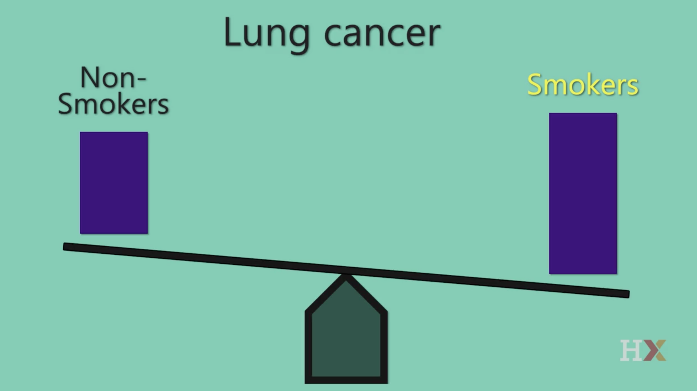
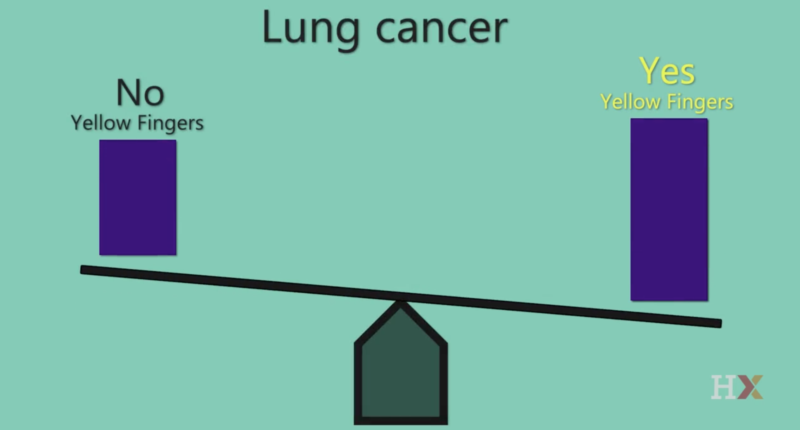
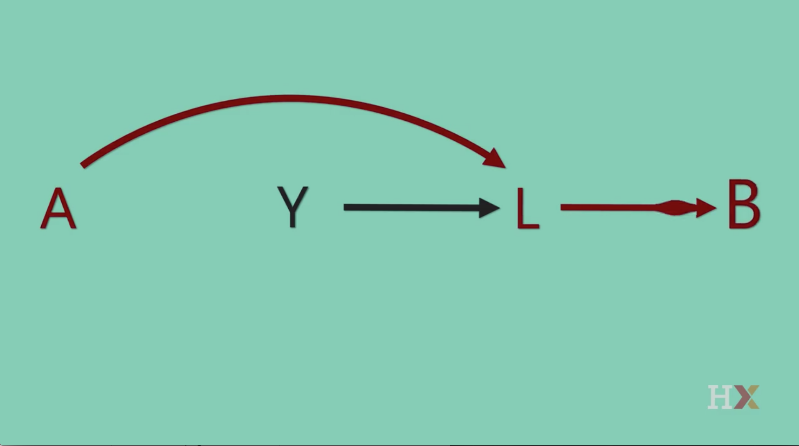
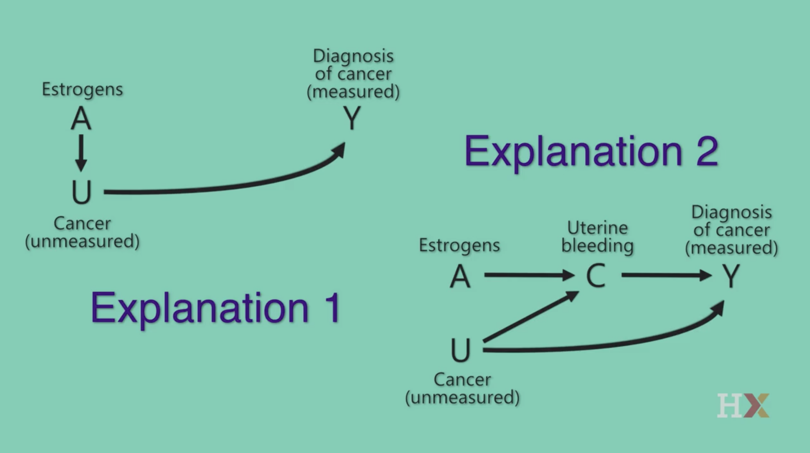

# Lesson 1

## Causal Diagrams

MIGUEL HERNAN: You probably know that the babies of mothers who smoke during pregnancy are more likely to die than the babies of mothers who did not smoke. What you may not know is that among babies born with low weight, the babies of mothers who smoke during pregnancy are less likely to die.  This is a surprising finding, and how do we interpret it? Is maternal smoking harmful for normal-weight babies but beneficial for low-birth weight babies? If so, should we recommend smoking for pregnant women when low-birth weight is suspected? Or is there another explanation?

In this course, we're going to talk about how to use simple pictures to think about causal questions-- questions like, what is the effect of maternal smoking on infant mortality? And we will consider many sorts of causal questions. We'll talk about the effects of medical treatments, of vitamin supplements, cigarette smoking, vaccinations, education, alcohol drinking.

In all cases, we will do so using causal diagrams.  Causal diagrams are really simple pictures.  But they have become a key tool for researchers who use data to evaluate causal effects.  In fact, if you are a data scientist, you will sooner or later encounter a causal question.  In this course, we will learn how causal diagrams can help us think about those questions.  The emergence of causal diagrams in the last two decades or so has revolutionized the way in which investigators approach causal questions.  Causal diagrams are now very important in many disciplines-- in epidemiology, statistics, computer science, policy evaluation, economics, sociology, psychology you name it.

As we will see in this course, causal diagrams help us summarize what we know about a problem and communicate our assumptions about its causal structure.  As a consequence, causal diagrams help us diagnose biases in causal inference.  For example, in this course, we will use causal diagrams to argue that maternal smoking is not necessarily beneficial for low-birth weight babies.  We will see how the surprising finding that I mentioned can be explained by bias.  

## Course Structure

MIGUEL HERNAN: The course has two parts.
The first part is organized into lessons.  Each lesson provides a non-technical overview of a component of a theory of causal diagrams.  And the operative word is non-technical.  You will see no math, no Greek letters, no theorems, no proofs.  Even though causal graph theory is a formal mathematical theory, we have made an effort to focus the teaching on the conceptual aspects and their practical implications.  So no deep mathematical training is necessary to follow this course.  Just a working knowledge of basic techniques for data analysis.

Our goal is that everyone who takes this course learns what can and cannot be done with causal diagrams, why they are so helpful, and also what their limitations are. If after learning that, you become interested in the underlying mathematical theory, do not worry.  There are plenty of resources for you to follow up.

The second part of the course is a series of case studies.  Each case study is a conversation with an expert investigator who will tell us about the real world research question, and about how causal diagrams help us think about it.  I really enjoyed listening to my colleagues sharing their experiences, and I'm sure that you will, too.

This course teaches how to think about causal inference using pictures rather than equations.  Causal diagrams help you organize your expert knowledge visually and therefore, they help you draw your assumptions before your conclusions.  

## Association vs Causation

MIGUEL HERNAN: Before we start, I'd like to briefly review two key concepts, causal effect and association.  The distinction between causation and association is crucial in research and in fact, causal diagrams are just a tool to navigate between association and causation.  Let's talk about causal effect first.

Suppose you have a large population of individuals and that they are all given a treatment.  We can then wait and see how many of them die.  Suppose 20% of them die.  Now suppose we have a time machine that can take us back in time.  Now we don't give treatment to anyone in the population.  We wait and see that 50% of them die.  If we could do this, we would have proven that the treatment has, on average, a causal effect on death in this population.  It prevents death.

Of course, in practice we cannot take people back in time.  What we can do is to compare two groups of people that are similar, essentially identical, with respect to their risk of death.  Quantifying causal effects requires the contrast of the same, or very similar, populations and their different levels of treatment.  Formally, we say that causal effects are defined by **counterfactual contrasts**.  In this course, we will not explicitly use counterfactual theory, but counterfactual theory underlines everything we do.  If you want to learn more about counter-factual causal inferences, there are plenty of materials available.

Now let's talk about association. Suppose we have a population of individuals.  Some of them receive treatment, and some of them do not.  Let's say that 30% of the treated die, and only 10% of the untreated die.  That doesn't mean that the treatment has a causal effect on death.  Perhaps treatment has no effect, but it is given to people who are at a higher risk of death anyway.  Yet, we say that treatment and death are associated, because the risk of death is different in the treated and the untreated.

Quantifying associations simply requires the contrast of two groups of individuals under different levels of treatment.  The association may be present, because treatment has a causal effect or because the groups of individuals are different.  So there may be association without causation.

We can think about association in another equivalent way.  We say that treatment and death are associated when having information about treatment status allows us to predict death better on average, which is precisely what happens in our example. If we learn that someone is treated, then we will predict she has a greater risk of death, even if treatment does not cause death.  Causal diagrams are very helpful, because they represent both association and causation simultaneously.  

## Estrogen and Uterine Cancer

MIGUEL HERNAN: Causal graphs are your friends.  And to show you why, in this segment, I'm going to describe a scientific controversy from the late '70s.  This is a debate that involved some of the most brilliant clinical investigators at the time.  And by the end of this session, when we will talk a little bit more about graphs in the next segments, you will be able to resolve this controversy by yourself and you will be convinced that causal graphs help us think better.

The 1970s was a fascinating decade that will be remembered for many things, but one of the most important things that happened during the early '70s is that for the first time in human history millions of women were receiving estrogen after menopause.  And this use of estrogen was encouraged by doctors, by the media, by popular books. However, investigators were very concerned, because in 1975 and '76, there were some studies that found that women receiving estrogens had a higher risk of being diagnosed with endometrial cancer than women not receiving estrogens.  And the question is why?

There is one obvious answer-- possible answer -- which is that estrogens cause cancer.  But there were two prominent clinical investigators from Yale, Alvin Feinstein and Ralph Horwitz, and they proposed another possibility.  They said that estrogens did not have to cause cancer for us to find this association between estrogen use and cancer.  They said that what might happen is that estrogens simply lead to a diagnosis of cancers that were already present, but would not have been diagnosed in the absence of estrogens.  They knew that between 20 and 60% of cancers are silent and asymptomatic, we only find them when we look for them.  And estrogen use causes uterine bleeding inside women.  So they reasoned that the bleeding was leading doctors to diagnose preexisting silent cancers.  And as a result, estrogen users have a higher rate of diagnosis of cancer, even if estrogens did not cause cancer by themselves. So what Feinstein and Horwitz said, in their own words is, "If estrogens provoke the bleeding that leads to uterine exam, asymptomatic uterine cancer is much more likely to be found in women receiving estrogens than in those who do not receive it." And they thought that this could fully explain the association between estrogen use and endometrial cancer.  They refer to this phenomenon as **ascertainment bias**.

Therefore, we have two possible explanations for the association between estrogen use and endometrial cancer.  One explanation is that estrogens simply accelerate the diagnosis of existing cancers, and two, estrogens actually cause cancer. Now, these two explanations have very different implications for clinical practice and for public health.  The question is how can we distinguish between these two explanations?  Which one is responsible for the association between estrogen use and endometrial cancer?  And this is where the debate was initiated and there was some discrepancies among investigators that we're going to discuss now.

On the one hand, the investigators from Yale, they proposed the following approach.  They said, well, since estrogens make some women bleed and therefore, more likely to be diagnosed with preexisting cancer, when we analyze data from these studies, let's restrict the data analysis to women who bleed, whether they are taking estrogens or not.  If we do that, then all women in the analysis, because they all have bled, they all have the same likelihood of being diagnosed with cancer if they have an existing cancer.  And therefore, if we still find an association between estrogen use and cancer, it must be that estrogens cause cancer.

But there were other equally prominent investigators who disagreed.  People like Hershel Jick, Ken Rothman, and Alec Walker, from Boston University and Harvard University, said that restricting to women who bleed was not the solution.  They argued that we would find an association between estrogen and cancer diagnosis even among women who bleed, and even if estrogens don't cause cancer.

As a consequence, if that was true, then the approach that was proposed by the Yale investigators would not truly distinguish between the two possible explanations.  We would still have some form of ascertainment bias.  And you may be wondering how is this possible?  What the Boston investigators said, it seems counter-intuitive.  Because if all women selected for the analysis experienced bleeding, then there should be no association due to the differential ascertainment.  Well, we will return to this question at the end of this lesson.  By that time, you'll be able to resolve this problem by yourself.

## What is a DAG

MIGUEL HERNAN: At this point in the course, you may be wondering how causal graphs look like.  This is the moment that you have been waiting for.  Meet your first causal diagram.  This is a causal diagram with three variables, or nodes: L, A, and Y. These variables are connected by arrows, which are also known as directed edges.

This is the causal graph that we will draw if we knew that L has an effect on A and A has an effect on Y, and also L has a direct effect on Y that is not mediated through A.  If we knew that some of these causal effects were not present, we would omit the corresponding arrow.  And because the arrows indicate the direction of causality, we refer to this graph as a **directed** graph.  So L causes A, but A doesn't cause L.

This graph has another important property.  It is **acyclic**.  That is, there are no cycles, meaning that if you start at one variable and follow the direction of the arrows, you will never get back to the same variable.  L causes A and A causes Y, but then Y doesn't cause L.

If you think of time as going from left to right on the graph, then that the graph is acyclic just means that the past affects the future, but the future doesn't affect the past.  And because these graphs are directed and they're acyclic, we refer to them as **DAGs** -- directed acyclic graphs.  Sometimes we will say causal graphs, sometimes we will say causal DAGs, we mean exactly the same thing.

And we draw DAGs by using our *expert knowledge* about the problem under study. If our expert knowledge is insufficient for us to *exclude* any possible effect, then we will draw all the arrows, like we did in the previous graph, and we say that the DAG is *complete*.  On the other hand, if our expert knowledge allows us to exclude some causal effects, then we will omit some of the arrows in the DAG. 

That's how we represent our knowledge, in the form of missing arrows.  And DAGs are used for many things, not only for causal inference.  Here, we are going to be dealing with causal DAGs.  A DAG is a *causal DAG* if when two variables on the graph share a cause, that cause is also represented on the graph.  This is known as the *Causal Markov Condition*.

Let's see a couple of examples.  Suppose that we are interested in the effect of Aspirin, A, on the risk of a stroke, Y. Now let's say that we have conducted an experiment in which 10,000 individuals were randomly assigned to receive an Aspirin and 10,000 and individuals were randomly assigned to not receive an Aspirin.  Now, for each person, we flip a coin-- heads, you get Aspirin, tails, you don't get Aspirin.  So A represents assignment to Aspirin.

The question is, do we need to add any more variables other than A and Y to the graph to make it a causal graph?  For example, you may be wondering about all these variables that are causes of Y, all the causes of a stroke that we know, like high blood pressure or coronary heart disease, diet, genes, and many, many others.  Shouldn't we add these variables to the graph?

Well, let me ask you something-- do any of these variables affect assignment to Aspirin?  No, of course not.  This is a randomized trial.  The only reason why some people got Aspirin is because we flipped a coin and there was heads, not because they had heart disease or because they had high blood pressure.  Therefore, all those causes of Y cannot possibly be causes of A. *They are not common causes of Y and A, and therefore, we don't need to include them in the graph*.  The simple graph that has A arrow Y is a causal DAG, even if it does not include all those other causes of Y.

Now consider a different situation.  Rather than having conducted a randomized trial, we did something very different.  We selected a large number of individuals and classified them into two groups according to the information in their electronic medical records.  In one group, we put everybody who started treatment with Aspirin, and in the other group, everybody who didn't start treatment with Aspirin.  So now A in our graph represents Aspirin use.  Again, the question is, do we need to add any variables other than A and Y to our graph to make it causal?

Okay -- let's think about some of these causes of stroke, Y, that were discussed before.  Take coronary heart disease.  Should we have an arrow from coronary heart disease into A?  Yes, because people who have coronary heart disease are more likely to start treatment with Aspirin in the real world.

Therefore, coronary heart disease is a common cause of A and Y, and it should be included in the graph.  So a causal graph for Aspirin and stroke that does not include coronary heart disease is not a causal DAG when we are not randomizing treatment. And therefore, that graph without coronary heart disease cannot be used to guide causal inference, as we will discuss in future segments.  We have now seen our first causal graphs.  In the next segment, we will start to explore the reasons why we like them so much.

## Cause and Effect

MIGUEL HERNAN: Why do we like causal graphs? After all, we have seen that causal graphs are simple pictures, that even a five year old can understand. How can they be so helpful to people conducting research? Well, causal DAGs are helpful because they are two things at the same time. On the one hand, they're **causal models**. They are qualitative causal models, but causal models. On the other hand, they are **statistical models**. That is, they're models that represent associations and independencies between variables.

That means that we can draw a causal graph using our expert knowledge, our causal knowledge, and at the same time, we are building a statistical model without knowing it.  And this dual nature is based on the fact that the causal effects imply associations.  And lack of causal effects imply independencies. And this is very important, because when we are conducting research we find *biases*. And these biases are *associations*.  Therefore, we can use causal graphs to conceptualize those biases and to identify them in our research.

OK, this may have sounded pretty abstract. There is a mathematical theory underlying causal graphs, but we don't need to master that theory in order to use causal graphs.  It's kind of like you don't need to know how a car works in order to ride it.  Later in this lesson we'll talk more about theory, but for now we are going to see how causal graphs work with examples, with informal examples.

Let us consider the simplest possible causal DAG with two variables, A arrow Y.

A is a variable that represent cigarette smoking and can take two values.  One, if the person is a smoker, zero if a person is not.  Y is a variable that represents lung cancer and can also take two values.  One if the person develops lung cancer, and zero if the person doesn't.  So we say that A and Y are binary variables or dichotomous variables.  We draw this causal graph because we believe that there is a causal effect of smoking, A, on cancer Y.  And to do that, we use our expert knowledge.  We didn't use any data. But what if we had data?  Well, if we had data, then we could compute the association between A and Y. So if A has a causal effect on Y, as represented by our graph, A arrow Y, do we expect to find an association between A and Y in our data?

To answer this question, suppose that we have a database with millions of people. And for each person we know whether they were cigarette smokers, A, and whether they develop lung cancer, Y.  What does an association between smoking, A, and cancer, Y, mean?  If we go back to our definition of association, we said that smoking and lung cancer are associated if the proportion of individuals with cancer is different among smokers and nonsmokers.  But this is precisely what we expect to happen if smoking causes cancer.  We expect A and Y to be associated when A has a causal effect on Y.  And we expect A and Y to be independent when A does not have an effect.

We can think about association in an equivalent way. We say that A and Y are associated when having information about A allows us to predict Y better on average.  And that is precisely what happens in our example. If we learn that someone is a cigarette smoker, then we will predict she has a risk of lung cancer that is greater than the average risk of cancer in the population.  And that's what I meant when I said that DAGs are both causal and statistical models.  Because if we use our expert knowledge to draw a causal graph, with no arrow from A to Y, then we are also drawing a statistical model that says that A and Y are independent, that they are not associated.

And more generally, graph theory gives us a rule.

> We can only exclude an association between A and Y if there is no arrow from A to Y.

Informally, we can see the arrow between A and Y as a pipe.  A pipe that carries association right on water.  If the arrow is there, then a flow of association between A and Y is expected. 

Let's now consider another question.  When we drew our graph, A arrow Y, we didn't include any variables between A and Y. But the effect of smoking A on lung cancer Y is obviously **mediated** by some variables.  For example, by the damage to the DNA of the cells of the lung that smoking causes.  So we could then have drawn a causal graph, A arrow B arrow Y, where B is cell damage.  And B, we say is a **mediator** of the effect of A on Y.  But we didn't do it.  We didn't include B on our graph.  And that's because *causal graphs do not need to include mediators when the goal is to estimate the total effect of A on Y*. If we needed information on mediators to estimate causal effects, then it will be impossible to estimate most causal effects.  Not even using randomized experiments, because we typically don't have any information on mediators in randomized experiments.

OK, but let's say that we decide to include the mediator B, cell damage, into our graph. This is the graph that we would draw if we believed that there is an effect of A on B, that there is an effect of B on Y, and that there is no direct effect of A on Y through pathways other than the A B Y pathway.  Again, this level of detail in the specification of the graph is unnecessary when we are interested in the total effect of A on Y.  But let's say that we have a graph with B. In this case, we can ask a new type of question. We can ask a question about **conditional independence**.  We can ask the question, are A and Y associated conditional on B or within levels of B?  Is there an association between A and Y, among individuals with a particular value of B? And to answer this question, we will need data on A, Y and of course, B. So suppose again that we have a database with millions of people and for each person we know whether they were cigarette smokers, whether they had cell damage, and whether they developed lung cancer.

And let me make a clarification here. The arrows of causal graphs are not meant to be deterministic.  That means that when we have an arrow from cigarette smoking A to cell damage B, that doesn't mean that for every single smoker we're going to see cell damage.  Because some smokers may never develop cell damage; some nonsmokers may develop cell damage for other reasons.

OK, so with this data on A, Y and B, we can answer the question on whether A and Y are associated conditional on B.  For example, we can restrict our analysis to a subset of individuals with cell damage with B equals one.  And to represent it graphically that we are conditioning on a particular value of B, one, we put a square box around B on the graph.

And now we can check in the subset of the population with cell damage B equals one whether there is an association between A and Y.  We just check whether the proportion of individuals with lung cancer is different among smokers and nonsmokers.  If the proportions are different, we will say that there is an association between A and Y conditional on B equals one.  Or another way to say this, we will check whether A contains information not already included in B that allows us to predict Y better. 

If the correct DAG is really A arrow B arrow Y, do we expect to find an association between A, cigarette smoking and Y, lung cancer, among people with B equals one with cell damage?  Well, according to this graph, the effect of smoking is entirely mediated through cell damage.  Therefore, if someone has cell damage, then learning that she's a smoker does not provide any additional information with respect to the risk of Y. You can think of it in this way.  If we know that someone with cell damage has a 10% chance of developing cancer, and then we learn that she is a cigarette smoker, that doesn't change the number. She still has a 10% chance of developing cancer.  Because under our graph, smoking can only affect cancer risk through cell damage.  And similarly, if we know that someone without cell damage has a 1% chance of developing cancer, then learning that she is a cigarette smoker does not change that number.  She still has a 1% chance of cancer.  We say that there's no conditional association between A and Y with the levels of B. And that's true for all levels of B, whether we are conditioning on B equals one, cell damage, or B equals zero, no cell damage.

And this is another example of why DAGs are both causal and statistical models.  We use our expert knowledge to draw a causal graph with no direct arrows from A to Y. And that implies a statistical model that says A and Y are independent conditional on B.  That they are not associated with the levels of B.

More generally, there's a rule in graph theory.

> The flow of association between A and Y is interrupted when we condition on the mediator, B. The box around B blocks the association between A and Y.

So if there is no direct arrow from A to Y, we say that there is no association between A and Y conditioned on B, even though A has a causal effect on Y.  OK, it's time to discuss another causal structure.

## Confounding

MIGUEL HERNAN: In this segment, we are going to continue to explore the relation between causal structures and association using graphs. Now we're going to consider a graph in which the variables A and Y share a cost, L. For example, A can be yellow fingers, having yellow fingers: yes, no. Y can be lung cancer: yes, no. And L, cigarette smoking: yes, no. 

There is an arrow from L to Y because smoking has a causal effect on cancer. There is an arrow from L to A because cigarette smoking has a causal effect on yellow fingers. People who are heavy smokers for many years tend to develop yellow fingers. But there is no arrow from A to Y because having yellow fingers doesn't have an effect on cancer. So we drew this causal graph using our expert knowledge. We didn't use any data. But what if we had data?

Well, if we had data, then we could compute the association between A and Y. So if A doesn't have a causal effect on Y, as represented by this graph with no arrow from A to Y, do we expect to find an association between A and Y in our data? To answer this question, again suppose that we have a database with millions of people. And for each person, we know whether they have yellow fingers (A), whether they develop lung cancer (Y).

What does an association between yellow fingers and cancer mean? Remember our definition of association, yellow fingers and lung cancer are associated if the proportion of individuals with lung cancer is different among those with and without yellow fingers.

But that is precisely what we expect to happen here. People with yellow fingers are more likely to have lung cancer than people without yellow fingers. And that's not because yellow fingers cause lung cancer, it is because having yellow fingers is a marker of smoking, which causes lung cancer. So we do expect A and Y to be associated even though A has no causal effect on Y.

Another way of saying this is that there is an association between A and Y because having information about A allows us to predict Y better on average. If you learn that someone has yellow fingers, it is likely that person has an above average risk of lung cancer. And this association is a **bias**.

When we're using data to estimate the causal effect of A on Y, any association between A and Y that is not due to the effect of A and Y is considered a **systematic bias**. In particular, when there is a component of the association between A and Y that is due to a common cause of A and Y, like L in our causal graph, we say that that is **confounding**. In our example, in naive investigator might conclude that yellow fingers cause cancer because yellow fingers and lung cancer are associated. And that would be an example of a biased effect estimate. And one of the most important goals of causal inference is to eliminate bias due to confounding. We'll have a full lesson to talk about this. 

What we have seen here is another example of how DAGs are both causal and statistical models. When we used our expert knowledge to draw a causal graph with no arrow from A to Y because we know that yellow fingers don't cause cancer, and with a common cause of A and Y because we know that cigarette smoking causes both yellow fingers and lung cancer, when we were doing that, we were also drawing a statistical model that says that A and Y are not expected to be independent, that they are expected to be associated.

More generally, graph theory gives us a rule, which is that

> we cannot exclude an association between A and Y when A
and Y have a common cause, L, even if there is no arrow from A to Y.

Informally, we can see that there is a flow of association between A and Y that is expected through L. Now let's say this again, because this simple graphic rule is related to confounding, and therefore very important for causal inference. The presence of a common cause of A and Y makes us expect an association between A and Y, even if A doesn't cause Y.

Let's now move to questions about **conditional independence**. So far, we have considered the association between A and Y without conditioning on a third variable. That is, we have considered the **unconditional**, the **marginal association** between A and Y. We will now consider the conditional association between A and Y within levels of L. For example, is there an association between yellow fingers and lung cancer among never smokers?

To answer these questions, we need data on A, Y, and L. Suppose again we have a database with millions of people, and for each person we know whether they were cigarette smokers, whether they had yellow fingers, and whether they developed lung cancer. With this data, we can answer the question of whether A and Y are associated conditional on L. For example, we can restrict the analysis to the subset of individuals who are never smokers. Remember, we use a square box around a variable to indicate that we're conditioning on it.

So now we can check in the subset of the population who are never smokers whether there is an association between A and Y. We just check whether the proportion of individuals with lung cancer is different among those with and without yellow fingers. If the proportions are different, we will say that there is an association between A and Y conditional on L where L is equal to never smoking. Another way to say this is that we will check whether A contains information not already included in L that allows us to predict Y better.

So if the correct DAG is one with arrows from L to A and L to Y, but no arrow from A to Y, do we expect to find an association between A, yellow fingers, and Y, lung cancer, in one particular level of L, never smokers? Well, according to this graph, the association between yellow fingers on cancer was a result of yellow fingers being a marker of smoking. Therefore if someone is a never smoker, learning that she has yellow fingers does not provide any additional information regarding the risk of Y.

Think of it in this way. If we know that a never smoker has a 1% chance of developing cancer, then learning that she has yellow fingers does not change that number. She still has a 1% chance of developing cancer. OK, one more time. Learning that someone has yellow fingers when we already know she's not a smoker does not provide any additional information regarding her risk of lung cancer. It just makes us wonder why she has yellow fingers. She may be a painter or something. But that is not associated with the risk of lung cancer.

Now, there's nothing special about the subset of never smokers. The same rationale applies to other subsets of the population defined by different levels of smoking. We said that L was a binary variable that can take values 1 or 0. But in practice, we'll have variables that can take many different values. What happens if we condition on each of those values? Well we still be able to say that there is no association between A and Y? Well, let's say that L is cigarette smoking, but can take values from, say, 0, no smoking, to 40, being a smoker of 40 cigarettes per day. What if we condition on the value of L equals to 40? We will say that there is no association between A and Y, between yellow fingers and lung cancer among people who smoke 40 cigarettes per day. Let's think about this. If we know that a smoker of 40 cigarettes per day has a 10% chance of developing cancer, then learning that she has yellow fingers does not change that number. She still has a 10% chance of cancer. Therefore, there is no conditional association between A and Y within levels of L regardless of which level of L we condition on. We can condition on L equal to never smoking or L to 40 cigarettes, and there is no association in either case.

This is another example of why DAGs are both causal and statistical models. We used our expert knowledge to draw a causal graph with arrows from L to A, and from L to Y, and with no arrow from A to Y. And that implied a statistical model that says that A and Y are independent conditional on L, that they are not associated with levels of L.

More generally, graph theory gives us a rule that says that

> the flow of association between A and Y is interrupted when we condition on their common cause, L. The box around L blocks the association between A and Y.

So there is no arrow from A to Y, we say that there is no association between A and Y conditional on L. And this simple graphical rule is very important for causal inference because if conditioning on L blocks the flow on association between A and Y, then conditioning on L is a way to fight confounding. And we will have a full lesson of confounding, but first we need to learn a few more things about DAGs. Now we are ready to discuss another causal structure.

## Selection Bias

MIGUEL HERNAN: In the previous segment, we studied the causal structure with common causes. Now we're going to study the causal structure with common effects.

So let's consider a graph in which the variables A and Y have a common effect L. For example, we can have three binary variables, where A is a genetic factor. You either have it or not, 1-0. Y is an environmental factor, you either have it or not, 1-0. And L is cancer.

There is an arrow from A to L, because the genetic factor increases the risk of cancer, and there is an arrow from Y to L because the environmental factor, say exposure to high levels of air pollution, also increases the risk of cancer. But there is no arrow from A to Y, because the genetic factor doesn't have any effect on your exposure to air pollution.

We draw this DAG using our expert knowledge. We didn't use any data. What if we had data? Well, when we have data, we can compute the association between A and Y. If A doesn't have a causal effect on Y, as we see in this graph, where there is no arrow from A to Y, do we expect to find an association between A and Y in the data? And, to answer this question, we go to our database with millions of people. For each person, we know whether they had the genetic factor A, whether they had the environmental factor Y. Now we can compute the association. But what does an association between the genetic and the environmental factor, between A and Y mean? We go back to our definition of association. We know that the genetic and environmental factors are associated if the proportion of individuals with environmental factors is different among those with and without the genetic factor.

Another way to say this, is that the genetic factor A contains information that allows us to predict the environmental factor Y better. If that's true, then there is an association.

So, under our graph with no arrows from A to Y but arrows from A and Y to L, do we expect to find an association between the genetic factor A and environmental factor Y? Well, according to this graph, an individual's exposure to high levels of air pollution was not affected by her genes. The environmental factor is distributed in the population independently of genes. Therefore, learning that an individual has the genetic factor does not provide any additional information regarding her environmental exposure. Think of it in this way. If we know that 5% of the population are exposed to high levels of air pollution, then 5% of the population with the genetic factor are exposed to high air pollution and also 5% of the population without the genetic factor. Learning that the person has the genetic factor does not to provide any additional information regarding her chance of having the environmental factor.

Therefore, there is no association between A and Y. A and Y are independent. Graphically, this means that the presence of a common effect of A and Y does not to create an association between A and Y. That both the genetic and the environmental factor may cause cancer in the future, does not imply that the genetic and environmental factor are associated today.

And this is another example of how DAGs are both causal and statistical models. When we use our expert knowledge to draw a causal graph with no arrow from A to Y, and with a common effect of A and Y, we were also drawing a statistical model that says that A and Y are independent, that they are not associated.

More generally, a rule of our theory is that

> common effects do not create an association.

And that is in contrast with what we saw in the previous segment when we saw that common causes create association. By the way, the common effect L is referred to as a **collider**. A collider because two arrowheads collide into it. Informally, colliders block the flow of association along the path that they lie on.

So far, we have considered the marginal or unconditional association between A and Y. Now we are going to continue the conditional association between A and Y within levels of L. For example, we are going to ask the question, is there an association between the genetic factor and environmental factor among people with lung cancer, among people with L equals 1. And to answer this question, we need data on A and Y, and L. Suppose, again, we have our database with millions of people, and for each person we know whether they had the genetic factor, whether they had the environmental factor, and whether they developed lung cancer. With this data, we can answer the question of whether A and Y are associated conditional on L equals 1. To do so, we restrict the analysis to a subset of individuals who developed cancer. Again, we use a square box around a variable to indicate that we are conditioning on that variable. 

Now we can say, in the subset of the population with cancer, whether there is an association between A and Y, between the genetic factor and the environmental factor. We just check whether the proportion of individuals exposed to high levels of air pollution is different among those with and without the genetic factor. If the proportions are different, we will say that there is an association between A and Y conditional on L=1. Or, another way to say this, we will check whether A contains information, not already included in L, that allows us to predict Y better.

If the correct DAG is the one with the arrows from A and Y to L, but no arrow from A to Y, do we expect to find an association between A, the genetic factor and Y, the environmental factor among those with L equals 1, cancer. Let's think about this. Let's say we know that someone has cancer. Now we learn that the person does not have the genetic factor. But she has cancer, so something must have caused the cancer. If it wasn't the genetic factor, then all other causes of cancer become more likely to exist. One of those causes is air pollution or any other environmental factors. Therefore, if someone has cancer L, but not the genetic factor, A, then that person is more likely to be exposed to high levels of air pollution. Not because the genetic factor protects against the environmental factor, but because cancer is present, and something must have caused it.

When we restrict the analysis to people with cancer, the proportion of people with the environmental factor is higher among people without the genetic factor than among people with the genetic factor. We do expect A and Y to be associated, even though A has no causal effect on Y. Think of it in this way. If we know that 5% of people with the genetic factor are exposed to high levels of air pollution, then when we select only those with cancer, we should expect more than 5%, perhaps 10%, of the population without the genetic factor to be exposed to high air pollution. If you learn that someone with cancer does not have the genetic factor, it is more likely that she will have the environmental factor. There is a conditional association between A and Y within levels of L. In this case, it is an inverse association. Not having the genetic factor A is associated with having the environmental factor Y among the selected group with cancer. And this association is a bias. When we are using data to estimate the causal effect of A and Y, then any association between A and Y that is not due to the effect of A or Y, is considered a systematic bias. In particular, in this case, when there is a component of the association of these, due to selecting a subset of the population, we say that there is **selection bias**.

In this example, a naive investigator might conclude that having certain genes protects against air pollution because genetic factors and environmental factors are inversely associated among people with cancer. And that could be an example of a biased effect estimate. An important goal of causal inference is to eliminate selection bias.

This is another example of how DAGs are both causal and statistical models. When we used our expert knowledge to draw a causal graph with no arrow from A to Y, and with a common effect of A and Y, we were also drawing a statistical model that says that A and Y are not expected to be independent, that they are expected to be associated with all or some levels of L.

More generally, the graph theory rule says that

> we cannot exclude an association between A and Y, when A and Y have a common effect L, and we condition on that common effect, even if there is no arrow from A to Y.

Informally, we can visualize a flow of association between A and Y through the condition on L. Let's say this again, because this simple graphical rule is related to selection bias, and therefore it is very important for a causal inference. In fact, we are going to have a full lesson on selection bias later. Conditioning on a common effect of A and Y makes us expect an association between A and Y even if A doesn't cause Y.

Before, we said that L was a collider. You can see that colliders behave exactly the opposite as all other variables on graphs. When they are not conditioned on, they block the flow of association through the path that they are on. But when they are conditioned on, they do not block the flow of association. This graphical rule, about conditioning on common effects, applies to *all* common effects, whether they are colliders or they are not colliders.

For example, consider a DAG in which we add a variable S, with an arrow from L to S. Now S is a common effect of A and Y, but it's not a collider. S is the effect of the collider. For example, let's say that S is lung surgery, which is often a treatment for lung cancer.

Do we expect to find a conditional association between A and Y within levels of S? To answer this question, we can use the same line of argumentation that we use when we consider a conditional association within levels of L. Suppose that someone had lung surgery, S equals 1. Well something must have caused it. If it is not the genetic factor A, then all other causes of lung surgery, including the environmental factor Y, become more likely. Therefore, we expect to find a conditional association between A and Y within levels of their common effect S. Selection bias will arise whether we condition on a collider or on something affected by a collider. And we are now ready to summarize all the graphical rules that we have learned.

## D-Separation

MIGUEL HERNAN: In the previous segments we have studied three sources of association between two variables.  Cause and effect, common causes and conditioning on common effects, either in the design or the analysis.  All three causal structures are expected to result in association.  So we say that these are structural sources of association.

Now there is another source of association that we didn't discuss: chance.  Because two variables may be associated by *chance*.  Even if one doesn't cause the other, even if they don't share causes, and if we don't condition on their common effects.  To see this, do you remember our example of a genetic factor A and environmental factor Y?  We said that we didn't expect them to be associated in our database of millions of people.  But suppose our database had only five people.  Three of them with a genetic factor A1.  And two of them without it, A0.  Say that by chance there was only one person with the environmental factor Y equals 1 in each group.  Then the proportion of individuals with Y equals 1 is different between those with A equals 1, one out of three, and those with A equals 0, one out of two.  So A and Y are associated by chance.

Chance is not a *structural source of association*, because we just need to increase the sample size to one million or one billion and chance associations decrease or disappear.  In contrast, the structural associations remain and become sharper as the sample size goes up.  But in practice, chance is very important.  In fact, it is so important that there's an entire scientific discipline in statistics that has been developed to quantify chance.  In this course, we are going to focus on the structure associations, which are the source of systematic bias.  And that means that we're always going to assume that we're working with a very large study population.  We won't have to worry about chance.  And we'll leave the statistical inference for another course.

So back to our structural sources of association.  We have cause and effect.  We have common causes and we have conditioning on common effects.  We have studied these three causal structures and their consequences for associations using informal examples in the past three segments.  But there is a formal theory of causal DAGs.  This theory of causal DAGs has been mathematically formalized by Judea Pearl at UCLA and Spirtes, Glymour and Scheines from Carnegie Mellon.  So let's talk a little bit about this graph theory.

First, how things are named.  Well, a variable B that is affected by a variable A is known as a *descendant* of A. So B can be a child of A or a grandchild of A.  And conversely, A is a parent or a grandparent
of B.

Another important concept in graph theory is the concept of **path**.  A path is *any* arrow-based route between two variables on the graph.  So some paths follow the direction of the arrows.  And other paths *do not* follow the direction of the arrows.  And paths can be either blocked or open.  And they are blocked or open according to a set of graphical rules known as the D-separation rules.

D-separation, which was proposed by Pearl in 1995, is a key part of causal graph theory.  We use D-separation to decide whether two variables are D-separated, where D stands for directional.  It turns out that we have already used D-separation in all of our examples in the previous segments.  But we weren't explicit.  Now we are going to define in an explicit way the four D-separation rules.

### D-SEPARATION RULE #1:

If there are no variables being conditioned on, a path is blocked if and only if two arrowheads on the path collide at some variable on the path.  For example, in the graph A arrow B arrow Y, the path between A and Y is open.
  

Whereas in the graph, A arrow L Y arrow L, with arrows from A Y to the collider L, the path between A and Y is blocked.

As an aside, the definition of collider is path-specific.  L is a collider on the path A arrow L arrow Y, but is not a collider on the path A arrow L arrow B.

### D-SEPARATION RULE #2:

Any path that contains a noncollider that has been conditioned on is blocked.  For example, in the graph A arrow B arrow Y, the path between A and Y is blocked after conditioning on B.

### D-SEPARATION RULE #3:

A collider that has been conditioned on, does not block a path.  For example, in the graph A arrow L, Y arrow L, a DAG with arrows from A and Y into the collider L, the path between A and Y is open after conditioning on L.

### D-SEPARATION RULE #4:

A collider that has a descendant that has been conditioned on does not block a path.  For example, in the graph with arrows from A and Y to L, the path between A and Y is open after conditioning on S, which is a descendant of the collider L.

The summary of these D-separation rules is that

> A path is blocked if, and only if, it contains a noncollider that has been conditioned on, or a collider that has not been conditioned on and has no descendant that had been conditioned on.

So two variables are D-separated if all paths between them are blocked and two variables are marginally or unconditionally independent if they are D-separated without conditioning on all the variables.  On the other hand, we say that two variables are conditionally independent, even a set variables L, if they are D-separated after conditioning on the variables L.

So now we have seen the rules of the D-separation in an explicit way. But if you go back to the examples for the last three segments, you will be able to see that all D-separation says is that two variables would be associated if one causes the other, if they share common causes, or they have a common effect and we condition on the common effect. So we have actually been using D-separation for the past three segments.

Before we move on to the next segment, we need to talk about another concept, **faithfulness**.

You see, in a causal DAG, we draw no arrow from A to Y when there is no causal effect of A on any individual's Y. And we draw an arrow from A to Y when A has a causal effect on the Y of at least one person in the population. So if we have a DAG, A arrow Y, we generally expect that there would be on average a causal effect of A on Y, and therefore, an association between A and Y. But that is not necessarily true. Because we may have a DAG with an arrow from A to Y and yet, neither an average causal effect nor an association.

For example, suppose that A is aspirin and Y is a stroke. And that aspirin causes a stroke in half of the population and prevents it in the other half. If these beneficial and harmful effects of A, of aspirin, perfectly cancel out the average causal effect is null. And yet, the DAG A arrow Y is correct, because A affects the Y of some individuals. In fact, of all individuals in the population.

In a case like this, the causal graph makes us expect an association because of D-separation that does not actually exists in the data. Because on average, there is no causal effect of A on Y. We say that the joint distribution of the data is not faithful to the causal DAG. And faithfulness is the result of opposite effects of exactly equal magnitude.

Now these perfect cancellations of effects are probably rare in nature. So we don't expect them to happen in practice. And that's why, in practice, lack of D-separation can be safely equated to non-zero association. Therefore, during this course we will consider D-separation equal to statistical independence. When all parts between two variables are blocked, we will say that the variables are not associated. 

### Questions on D-Separation

## Estrogens and Uterine Cancer: The Explanation

MIGUEL HERNAN: We're now ready to go back to the 1970s. In the previous segments we have learned simple graphical tools to resolve the controversy that we described at the start of this lesson. As we said, the association between estrogens and endometrial cancer was well established in the 1970s. At that time, it was established that women taking estrogens had a higher incidence of endometrial cancer diagnoses than women not taking estrogens. And there were two possible explanations for that association between estrogens and cancer diagnosis. One, estrogens actually cause cancer. Two, estrogens accelerate the diagnosis of silent cancer. Because estrogens increase the risk of uterine bleeding, which leads to diagnostic efforts that would not have happened otherwise. These two explanations have very different implications for clinical practice and for public health. So let's draw causal graphs now to represent each of these explanations.

The first explanation, estrogens cause cancer, can be represented by a causal graph with three binary variables. A, estrogens, U, endometrial cancer, which is an unmeasured variable, and Y, diagnosis of endometrial cancer, which is a measured variable. That means that we have data on A and Y, but we don't have data on U.

The second explanation, estrogens accelerate the diagnoses of silent cancer, can be represented by a causal graph with one additional binary available, C, uterine bleeding. And there are arrows from A to C, because estrogens cause bleeding; from U to C, because cancer causes bleeding; and from C to Y, because bleeding accelerate the diagnosis of cancer. But there is no arrow from A to U. 

The question is how to distinguish between these two explanations for the association between A and Y. Estrogens cause cancer, estrogens accelerate the cancer diagnosis. To answer this question, two investigators from Yale proposed to restrict the data analysis to women who bleed, whether they are taking estrogens or not. That way, all women in the analysis, regardless of estrogens use, will have the same risk of having silent cancers diagnosed. If we still find an association between estrogen use and cancer, it must be that estrogens cause cancer.

But as you may remember, several investigators from Boston and Harvard disagreed. They argued that an association between estrogen use and cancer diagnosis can arise in analyses restricted to women who bleed, even if estrogens don't cause cancer. Who was right? Well, now we can use graph theory to analyze both proposals and resolve the controversy. Here we are going to follow Jamie Robins, who in 2001 showed how to apply this separation to this very issue.

First, we need to translate the Yale investigator's proposal from English into DAG-ish. Ready? Let's go. This is the graphical description of the argument to restrict analysis to women who bleed. The association between A and Y that we would like to eliminate is due to the path A arrow C arrow Y. Let's block that path by restricting the studies to women who bleed. That is, we put a square around C.

Now if an association between A and Y is still found, it must be that there is a path arrow U arrow Y.

Seems to make a lot of sense. So why did the Boston investigators disagree? They argued that an association between A and Y may exist, even when we condition on C. Even if there is no arrow from A to Y to U. How is that possible? Well, let's look at the entire causal graph.

It is true that conditioning on C blocks the path A, C, Y. But that's not the only path between A and Y. There is another path that is A, C, U, Y. And on that path, C is a collider. So the path is blocked when we don't condition on C, but becomes open when we condition on C. And conditioning on C is precisely what we do when we restrict the analysis to women who bleed. So the Boston investigators were correct. A and Y may still be associated when we restrict the analysis to bleeders. Even if A does not cause cancer U.
So by applying this separation to this DAG, we learn that an analysis restricted to women who bleed does not necessarily help us distinguish between the two explanations for the association between A and Y. What can we do then? Let's look at the graph again.

See, the path that is causing trouble is the path A arrow C arrow Y. This path has two arrows. And there's nothing we can do about the arrow from estrogens A to bleeding C, because that's human physiology. But we could design studies in which the arrow from C to Y does not exist. For example, by requiring all women in the study to be screened for cancer frequently, whether they bleed or not. So if we design a study in which there is no arrow from C to Y by design, and we don't condition on C, we don't have to restrict now to women who bleed. If in this study we don't find an association between A and Y, then we learn that there is no arrow from estrogens A to cancer U. We have ruled out the explanation that estrogens cause cancer. On the other hand, if after doing this, after removing the arrow from C to Y, we still find an association between A and Y, then it must be the case that A causes U.

And this is an example of how causal graphs can be used to understand a problem and explore possible solutions. We, of course, oversimplified this a little bit, but just enough to show the main points. And one of those main points is that even without mastering the mathematical theory underlying DAGs, we can translate our qualitative subject knowledge, expert knowledge, causal knowledge, into a picture, into a causal graph. And this picture can then be used to identify problems in the study design and to guide the data analysis. And also to make the scientific discussion much more precise and efficient. Rather than writing many pages describing our assumptions, we can just draw a picture that represents them. So as I said at the start of this lesson, causal graphs are your friends.